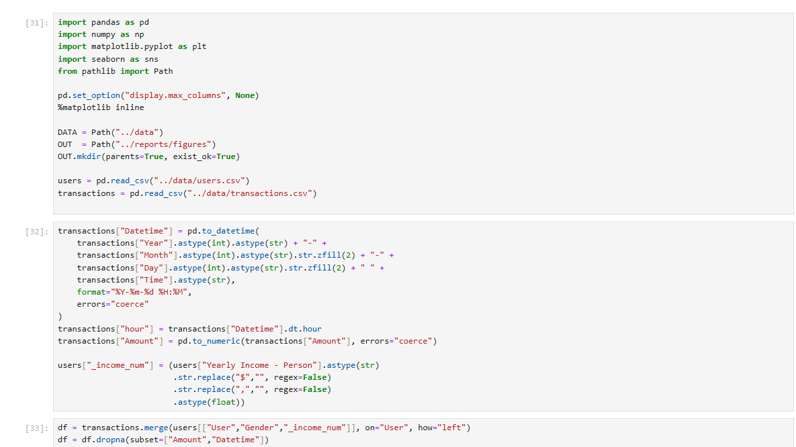
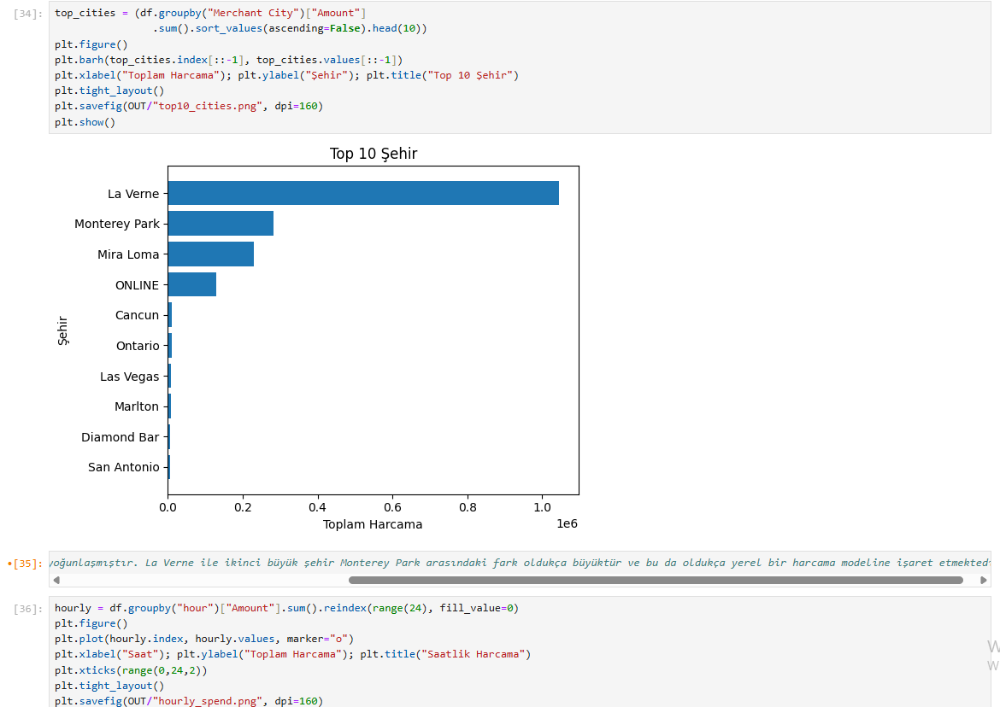
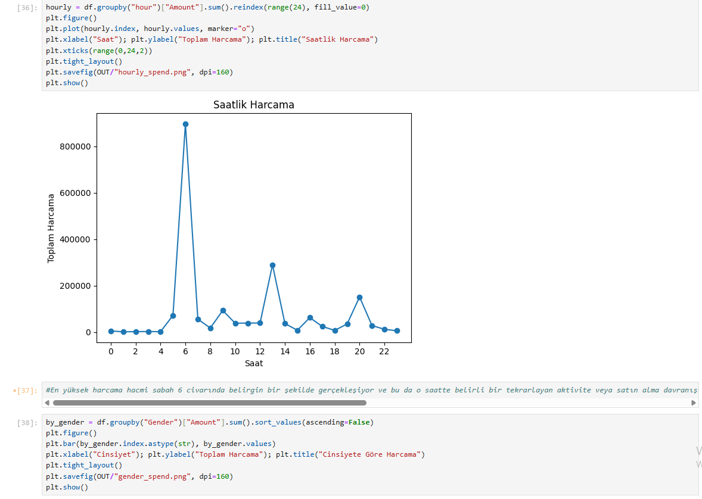
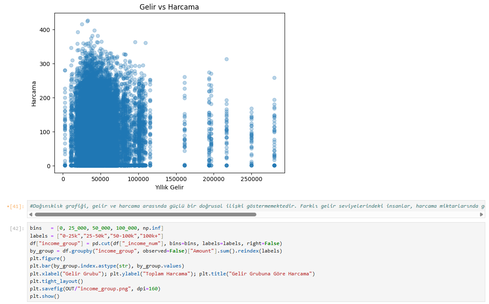
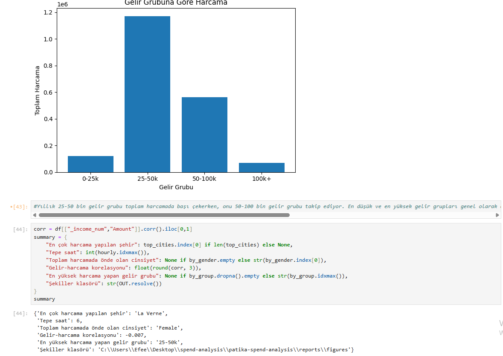

# patika-spend-analysis

# 📊 Kredi Kartı Harcamaları Veri Analizi

Bu proje, kredi kartı kullanıcılarının harcama verilerini analiz ederek kullanıcı davranışları hakkında anlamlı içgörüler çıkarmayı amaçlar. Python (Pandas, Matplotlib, Seaborn) ile veri ön işleme ve görselleştirme yapılmış, ayrıca Power BI ile dashboard tasarlanmıştır.

## 🚀 Projenin Amacı
- Kullanıcıların şehir, saat, cinsiyet ve gelir grubuna göre harcama alışkanlıklarını analiz etmek.
- Verileri farklı kırılımlarda görselleştirerek anlamlı sonuçlar elde etmek.
- Python tarafında analiz notebook'u, Power BI tarafında ise etkileşimli bir dashboard sunmak.

## 📂 Proje Yapısı
patika-spend-analysis/
│
├── data/ # CSV veri dosyaları (users.csv, transactions.csv)
├── notebooks/ # Jupyter Notebook analiz dosyaları
├── reports/
│ └── figures/ # Üretilen grafik görselleri
├── src/ # (Opsiyonel) Yardımcı Python modülleri
├── requirements.txt # Bağımlılık listesi
└── README.md # Proje dokümantasyonu

## Ekran Görüntüleri

## 🛠 Kullanılan Teknolojiler
- Python 3.x
- Pandas
- Matplotlib
- Seaborn
- Jupyter Notebook
- Power BI

## ⚙️ Kurulum ve Çalıştırma
1. **Proje klasörüne gir:**
    cd cc-spend-analysis
    Sanal ortam oluştur ve etkinleştir:
    python -m venv .venv
    pip install -r requirements.txt
    Notebook'u başlat:
    jupyter notebook
    notebooks/01_analysis.ipynb dosyasını aç.
    Hücreleri sırasıyla çalıştır.

📊 Üretilen Analizler
Top 10 Şehir: En fazla harcama yapılan 10 şehir (Bar grafiği)

Saatlik Harcama Dağılımı: Günün saatlerine göre toplam harcama (Çizgi grafiği)

Cinsiyete Göre Harcama: Erkek/Kadın karşılaştırması (Bar grafiği)

Gelir vs Harcama: Yıllık gelir ile harcama arasındaki ilişki (Scatter plot)

Gelir Gruplarına Göre Harcama: Belirli gelir aralıklarına göre toplam harcama (Bar grafiği)

🖼 Ekran Görüntüleri
Top 10 Şehir

Saatlik Harcama

Cinsiyet Dağılımı

Gelir vs Harcama

Gelir Grupları

📌 Notlar
Veri setleri proje klasörü içinde data/ altında bulunmalıdır.

Power BI çalışması .pbix formatında ayrı olarak teslim edilmelidir.

Repository private olarak tutulmalıdır.

Efe Boyaci - 11.08.25